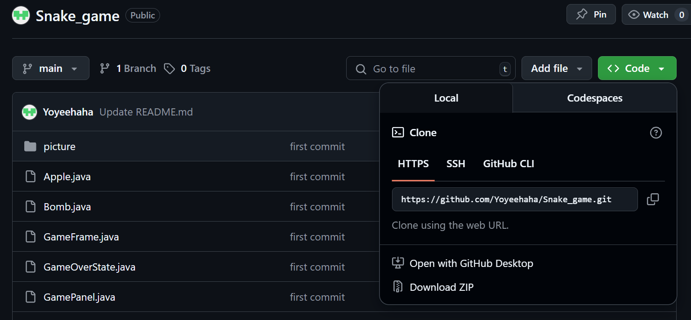
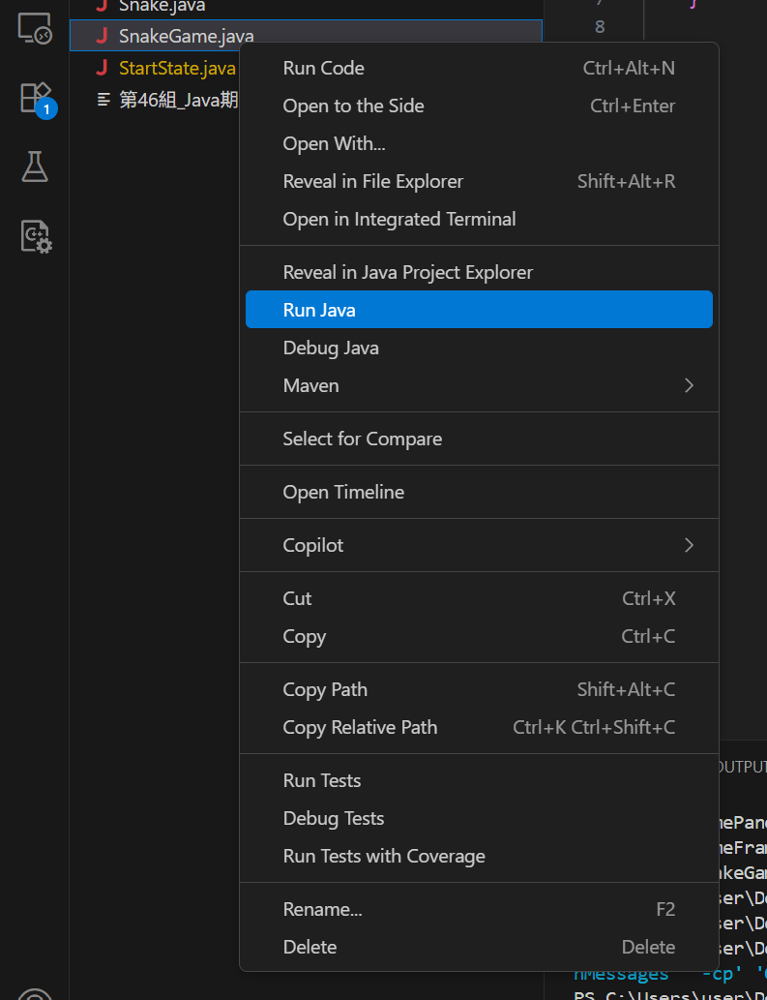
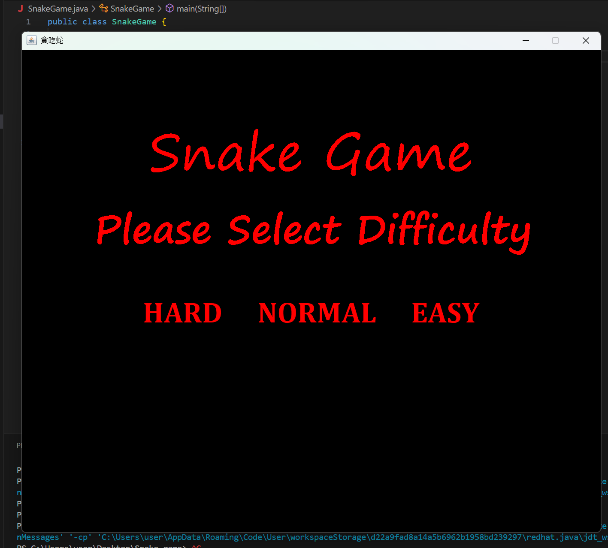

# 🌟 Project Name

### Snake Game :snake:

# ❓ What's this for ?

### Final project of Java_Software_Development (2024 Spring)

# 🎮 How to play it ?

### You can use either VSCode or eclipse as your IDE, I'll take VSCode as example

#### 1️⃣ Download or git clone the whole repository

#### 2️⃣ find "SnakeGame.java" this file and right click it in VSCode
#### 3️⃣ Select "Run java"

#### 4️⃣ Then enjoy you game!!
  
